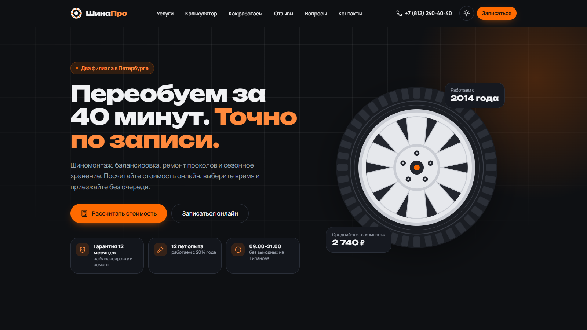
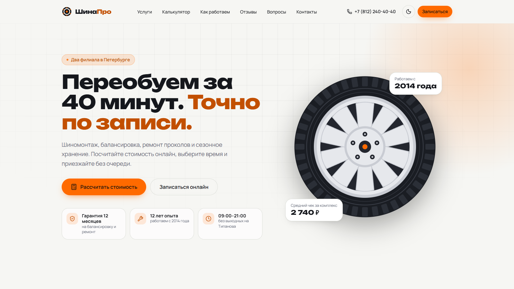
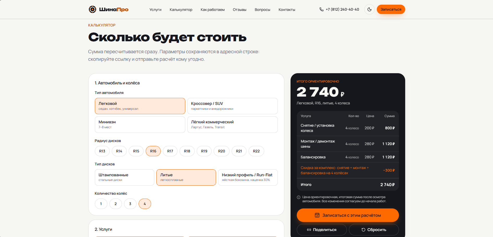
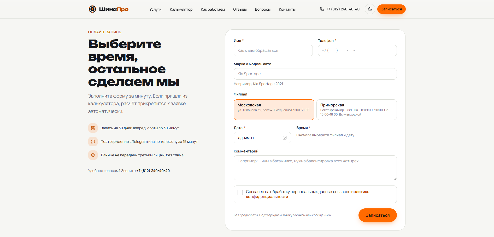
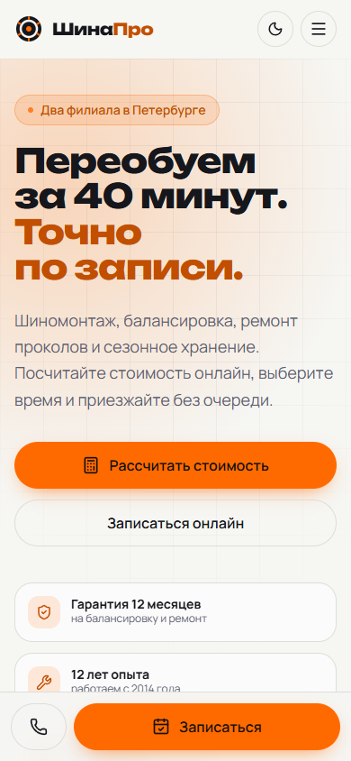
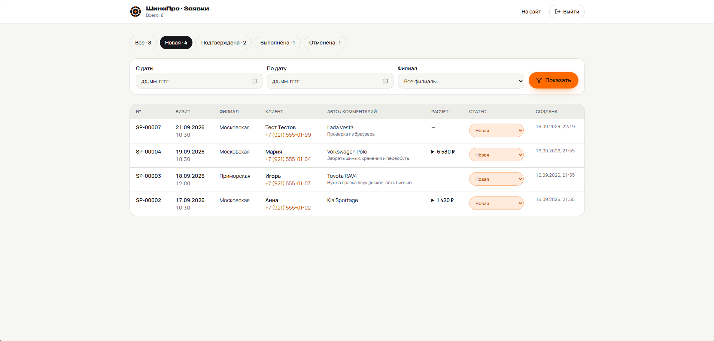

# ШинаПро — сайт шиномонтажа и Telegram Mini App

> Учебный production-ready проект для портфолио: сайт вымышленного шиномонтажа
> в Санкт-Петербурге и Telegram Mini App к нему. Next.js 16 (App Router), TypeScript strict,
> Tailwind CSS 4, Prisma (SQLite локально, Postgres в Neon на проде), Telegram Mini Apps SDK.
> Запускается локально одной командой,
> деплоится на Vercel.

**Демо:** <https://shinapro.vercel.app> · Mini App: `/app` · админка: `/admin`

Записаться можно двумя путями — с сайта и из мессенджера, — и оба ведут в одну таблицу заявок.
Слоты у них общие: занятое в Telegram время исчезает на сайте и наоборот.

<p align="center">
  
</p>

## Задача «заказчика»

Сеть из двух шиномонтажей хочет перестать терять клиентов в сезон: люди звонят, не дозваниваются
и уезжают к конкурентам. Нужен сайт, который:

1. **Считает стоимость** без звонка: клиент сам выбирает авто, радиус, тип дисков и услуги и сразу
   видит сумму с детализацией. Прайс владелец правит сам, без разработчика.
2. **Записывает на конкретное время** с шагом 30 минут, показывает только свободные слоты и не
   даёт забронировать занятые.
3. **Принимает запись прямо из Telegram**: половина клиентов пишет туда, и уходить из мессенджера
   ради формы на сайте им лень.
4. Даёт **простую админку**, где видно все заявки — и с сайта, и из приложения — и можно менять
   их статус.
5. Быстро работает на телефоне, выглядит современно и хорошо индексируется.

## Скриншоты

| Главная (тёмная тема)                                   | Главная (светлая тема)                                    |
| ------------------------------------------------------- | --------------------------------------------------------- |
|  |  |

| Калькулятор с детализацией                      | Форма записи с прикреплённым расчётом         |
| ----------------------------------------------- | --------------------------------------------- |
|  |  |

| Мобильная версия                                 | Админка                                |
| ------------------------------------------------ | -------------------------------------- |
|  |  |

## Стек и почему он

| Технология                    | Зачем                                                                                                       |
| ----------------------------- | ----------------------------------------------------------------------------------------------------------- |
| **Next.js 16, App Router**    | SSG для лендинга и страниц услуг (SEO, скорость), Route Handlers для API, один деплой на Vercel без бэкенда |
| **TypeScript strict**         | `noUncheckedIndexedAccess`, без `any`: прайс, схемы и API типизированы сквозь весь проект                   |
| **Tailwind CSS 4**            | Дизайн-токены в CSS (`@theme`), тёмная тема через класс, никакого runtime-CSS                               |
| **React Hook Form + Zod 4**   | Одна Zod-схема валидирует форму на клиенте и тело запроса на сервере: правила не расходятся                 |
| **Prisma 6 + SQLite**         | Ноль настройки для локального запуска; смена на Postgres — одна строка в `schema.prisma`                    |
| **Telegram Mini Apps SDK**    | Запись внутри мессенджера: тема, MainButton и BackButton клиента, подпись initData проверяется на сервере   |
| **Telegram Bot API**          | Бот открывает приложение по `/start`; вебхук на том же Next.js, без отдельного сервиса                      |
| **Vitest**                    | Быстрые unit-тесты чистых функций: калькулятор, слоты, маска телефона, rate limit                           |
| **next/font + Google Fonts**  | Unbounded (заголовки) и Manrope (текст) с кириллицей, self-hosted, без запросов к Google в рантайме         |
| **lucide-react, next-themes** | Лёгкие иконки с tree-shaking и переключение темы без FOUC                                                   |

Без платных сервисов и внешних SaaS: карта грузится по клику с публичного виджета Яндекс.Карт.

## Ключевые фичи

### Калькулятор стоимости

- **Однооконный с живым пересчётом**, а не пошаговый мастер. Обоснование: параметров всего шесть,
  пользователь часто возвращается «поиграть» с радиусом и услугами, и stepper заставлял бы кликать
  «назад». Итог всегда виден в липкой панели справа (на мобильном — под формой).
- Весь прайс в [`src/config/pricing.ts`](src/config/pricing.ts): диапазоны радиусов, коэффициенты
  за тип авто и дисков, скидки. Логика в [`src/lib/calculator.ts`](src/lib/calculator.ts) — чистые
  функции, покрытые 48 unit-тестами, принимают конфиг параметром.
- Детализация «услуга — количество — цена — сумма», скидка за комплекс и за долгое хранение,
  наценка за срочность считается после скидок.
- Сумма анимируется (`requestAnimationFrame`, уважает `prefers-reduced-motion`), число для
  скринридера всегда финальное.
- **Состояние живёт в URL** (`?v=suv&r=18&s=ri,md,bal&p=1`): ссылкой можно поделиться, страницы
  услуг предзаполняют калькулятор. Кодек в [`src/lib/calculator-url.ts`](src/lib/calculator-url.ts).
- «Записаться с этим расчётом» прикрепляет снимок расчёта к форме, он уходит в БД и виден в админке.

### Онлайн-запись по слотам

- Дата ограничена «сегодня + 30 дней», выходные берутся из графика филиала
  ([`src/config/site.ts`](src/config/site.ts)): филиал на Богатырском не работает по воскресеньям.
- Слоты генерирует чистая функция [`src/lib/slots.ts`](src/lib/slots.ts): шаг 30 минут, запас
  60 минут до ближайшего слота, «сегодня» считается по часовому поясу филиала, а не сервера.
- Занятые слоты берутся из БД, общей с Mini App: записанное в Telegram время исчезает на сайте.
- Двойную бронь ловят два рубежа. Создание идёт в транзакции с повторной проверкой слота, но на
  Postgres при READ COMMITTED этого мало: две одновременные транзакции обе увидят «свободно».
  Поэтому в базе стоит частичный уникальный индекс на `(branchId, date, time)` для неотменённых
  заявок ([`prisma/constraints.sql`](prisma/constraints.sql)) — он закрывает окно физически,
  а приложение переводит отказ базы в тот же `409`.
- Маска телефона `+7 (___) ___-__-__` без библиотек, состояния загрузки / успеха с номером
  заявки / ошибки с повтором.
- Антиспам: honeypot-поле (боту отвечаем фальшивым успехом) + rate limit по IP со скользящим окном.

### Telegram Mini App `/app`

Запись за четыре шага: услуга → параметры колёс → филиал, дата и время → подтверждение.
Сумма пересчитывается на экране, пока человек крутит радиус: чек приклеен к низу над кнопкой
Telegram, строки появляются и исчезают вместе с параметрами.

Приложение намеренно не имеет собственного лица. В его CSS нет ни одного цвета — все приходят
из `themeParams` с подпиской на `themeChanged`. Фон экрана и фон блока берутся из
`secondary_bg_color` и `section_bg_color`, а не угадываются: в светлой теме секция белая на сером,
в тёмной наоборот. Главное действие каждого шага живёт на MainButton самого мессенджера,
возврат — на BackButton, он же перехватывает системную «назад»; подтверждение отмены — нативный
`showConfirm`, вибрация на выборе слота и на успешной записи.

Прайс у сайта и у приложения один — `src/config/pricing.ts`. Mini App получает его через
`/api/miniapp/pricing` и пересчитывает сумму на экране сам, чтобы не ходить на сервер на каждое
касание; в заявку же уходит то, что посчитал сервер. За тем, чтобы обе реализации считали
одинаково, следит `miniapp-parity.test.ts` — он прогоняет через них больше двух с половиной тысяч
комбинаций и требует совпадения до рубля, включая подписи строк расчёта.

Подпись `initData` проверяется на сервере: HMAC-SHA256, `secret_key = HMAC_SHA256("WebAppData", BOT_TOKEN)`,
свежесть `auth_date` не больше суток. Telegram id берётся только оттуда — в телах запросов его нет,
поэтому чужие записи не посмотреть и не отменить, даже зная их номер.

Открытое в обычном браузере приложение не ломается, а работает как интерактивное демо: данные
лежат в памяти вкладки, MainButton и BackButton эмулируются, тема переключается в шапке.

Бот минимальный: `/start` здоровается и открывает приложение. Уведомлений о заявках он не шлёт —
всё видно в админке.

### Сезонное хранение — услуга без слота

У хранения бронируется день сдачи шин, а не получас работ: кладовщик примет комплект в любое время
в часы работы филиала. Поэтому на третьем шаге вместо сетки времени — календарь и полоса периода
«сдаёте — забираете», в базе у такой заявки `time = NULL`, а в «Моих записях» она показана
периодом `18 сен — 18 мар`. Частичный уникальный индекс считает `NULL`-значения различными,
так что несколько сдач в один день друг другу не мешают.

### Мини-админка `/admin`

Пароль из `.env`, сессия в httpOnly-cookie с HMAC-подписью, rate limit на попытки входа. Таблица
заявок с фильтрами по статусу, дате и филиалу, смена статуса без перезагрузки, раскрывающийся расчёт.

### Качество

- Семантическая вёрстка, `aria-*`, видимый фокус, `inert` для скрытого меню, клавиатурная
  навигация по радио-чипам и аккордеону.
- SEO: метатеги и Open Graph (картинка генерируется на сервере), `sitemap.xml`, `robots.txt`,
  Schema.org `AutoRepair` с двумя филиалами, каталогом услуг и `FAQPage`.
- Тёмная и светлая темы, mobile-first от 360px, липкая кнопка «Записаться» на телефонах.
- У каждой секции своя структура: карточки только у услуг, шаги нарисованы линией с засечками,
  преимущества и отзывы собраны на тонких линейках. Анимация появления оставлена в двух местах,
  чтобы оставаться акцентом, а не фоном.
- ESLint (flat config, `next/core-web-vitals`, React Compiler rules) + Prettier с плагином Tailwind.

### Lighthouse (production build, Lighthouse 13)

| Профиль             | Performance | Accessibility | Best Practices | SEO |
| ------------------- | ----------: | ------------: | -------------: | --: |
| Mobile (6 прогонов) |       90–94 |           100 |            100 | 100 |
| Desktop             |         100 |           100 |            100 | 100 |

Что для этого сделано: калькулятор и форма записи грузятся отдельными чанками при приближении
к viewport (или сразу по якорю/параметрам), карта за «фасадом», знак `₽` берётся из системного
шрифта (иначе один символ тянул +130 КБ latin-ext), шрифт заголовков — один статический вес,
`browserslist` без legacy-полифиллов. Отдельная находка: слайдер отзывов на `scroll-snap`
делал «доснап» на 16px при загрузке, а Chrome прекращает измерять LCP после первого скролла —
исправлено через `scroll-padding`.

## Структура проекта

```
prisma/
  schema.prisma          # модель Booking (SQLite)
  constraints.sql        # частичный уникальный индекс: защита от двойной брони
  seed.ts                # тестовые заявки на ближайшие дни
public/app/              # Telegram Mini App: HTML, CSS и ES-модули без сборщика
  index.html, styles.css
  js/                    # app (сценарий), ui, tg (мост в Telegram), theme, pricing, api, demo, util
scripts/
  setup-env.mjs          # создаёт .env из .env.example с случайным секретом
  db-constraints.mjs     # применяет constraints.sql после prisma db push
  set-webhook.mjs        # ставит и снимает webhook бота
src/
  app/
    (site)/              # публичная часть: layout с шапкой и подвалом
      page.tsx           # главная: все секции
      services/[slug]/   # страницы услуг (SSG)
      privacy/           # политика ПДн
    admin/               # мини-админка (force-dynamic)
    api/
      bookings/          # POST создание заявки с сайта
      slots/             # GET свободные слоты
      miniapp/           # pricing, slots, bookings (GET/POST), bookings/cancel
      bot/               # webhook: /start и кнопка открытия Mini App
      admin/             # login, logout, PATCH статуса
    layout.tsx, globals.css, not-found.tsx, sitemap.ts, robots.ts, opengraph-image.tsx
  components/
    ui/                  # Button, Field, ChoiceGroup, Stepper, Accordion, AnimatedNumber, Reveal…
    sections/            # Hero, Services, Calculator, HowItWorks, Advantages, Reviews, Faq, Contacts, Booking
    calculator/          # форма, сводка, ленивая обёртка
    booking/             # форма записи, маска телефона, слоты, вложение расчёта, контекст
    layout/              # Header, Footer, StickyCta, JsonLd
    admin/               # LoginForm, StatusSelect, LogoutButton
  config/                # site, pricing, services, reviews, faq — весь контент и цены
  lib/                   # calculator, calculator-url, slots, dates, phone, format, telegram,
                         # rate-limit, auth, bookings, prisma, schemas/booking,
                         # miniapp (каталог и мост к калькулятору), telegram-webapp (подпись
                         # initData), miniapp-http, __tests__/
```

## Запуск локально

Требуется Node.js 20.9+.

```bash
git clone https://github.com/Einsteinring/shinapro.git && cd shinapro
npm install
npm run dev:setup
```

`dev:setup` создаёт `.env` из `.env.example` (со случайным `ADMIN_SESSION_SECRET`), генерирует
Prisma Client, создаёт SQLite-базу, заливает тестовые заявки и запускает `next dev`.
Сайт: <http://localhost:3000>, админка: <http://localhost:3000/admin> (пароль `change-me`).

Полезные команды:

| Команда             | Что делает                                     |
| ------------------- | ---------------------------------------------- |
| `npm run dev`       | dev-сервер (Turbopack)                         |
| `npm run build`     | production-сборка                              |
| `npm test`          | unit-тесты (Vitest)                            |
| `npm run lint`      | ESLint                                         |
| `npm run typecheck` | `tsc --noEmit`                                 |
| `npm run format`    | Prettier                                       |
| `npm run db:studio` | Prisma Studio для просмотра базы               |
| `npm run db:seed`   | повторно залить тестовые данные (идемпотентно) |
| `npm run db:push`   | применить схему и `constraints.sql` к базе     |

Mini App открывается по <http://localhost:3000/app>. Без Telegram он уходит в демо-режим:
`initData` пустой, данные живут в памяти вкладки. Чтобы увидеть, как приложение отрабатывает
гонку за один слот, займите слот из консоли, пока открыт экран подтверждения:

```js
shinapro.occupy(shinapro.state.date, "14:30");
```

### Переменные окружения

См. [`.env.example`](.env.example). Для Mini App нужен бот: создайте его через @BotFather
и положите токен в `TELEGRAM_BOT_TOKEN` — им же проверяется подпись `initData`, без него
приложение никого не пустит. Проверить токен одной командой:

```bash
npm run telegram:test
```

Уведомлений о заявках нет: и сайт, и Mini App пишут в одну таблицу, заявки разбираются в `/admin`.

Если `api.telegram.org` у вас доступен только через VPN или локальный прокси, укажите его адрес
в `TELEGRAM_PROXY` (например, `http://127.0.0.1:10809`): приложение и тест пойдут через него.
На сервере переменную оставляют пустой.

## Деплой на Vercel

Файловая SQLite не переживает деплой на serverless, поэтому в продакшене используется Postgres.
В проекте две Prisma-схемы с одной моделью: `prisma/schema.prisma` (SQLite, локально) и
`prisma/schema.postgres.prisma`; нужную выбирает `scripts/prisma.mjs` по префиксу `DATABASE_URL`.

1. Создайте бесплатную базу на [neon.tech](https://neon.tech) и скопируйте строку подключения
   `postgresql://…` (прямую, не pooled).
2. Импортируйте репозиторий в Vercel, фреймворк определится автоматически.
3. В настройках проекта добавьте переменные окружения:
   - `DATABASE_URL` — строка из Neon;
   - `NEXT_PUBLIC_SITE_URL` — публичный адрес, например `https://shinapro.vercel.app`;
   - `ADMIN_PASSWORD`, `ADMIN_SESSION_SECRET` — свои значения;
   - `TELEGRAM_BOT_TOKEN`, `TELEGRAM_WEBHOOK_SECRET` — для Mini App и бота. `TELEGRAM_PROXY` не нужен.
4. Нажмите Deploy. Vercel сам выполнит `npm run vercel-build`: создаст таблицы в Neon
   (`prisma db push`), применит `constraints.sql`, сгенерирует клиент и соберёт сайт.
   Каждый пуш в `main` обновляет сайт.
5. Подключите бота к приложению:

   ```bash
   npm run telegram:webhook
   ```

   Адрес берётся из `NEXT_PUBLIC_SITE_URL`, секрет — из `TELEGRAM_WEBHOOK_SECRET`.
   Проверить: `node scripts/set-webhook.mjs --info`.

6. В @BotFather: `/setmenubutton` → выберите бота → пришлите `https://ваш-домен/app` → название
   кнопки «Записаться». Она появится в поле ввода рядом со скрепкой.

Rate limit хранится в памяти инстанса. Для serverless можно заменить хранилище в
[`src/lib/rate-limit.ts`](src/lib/rate-limit.ts) на Upstash Redis, сигнатура функции не меняется.

Для VPS/Docker всё проще: SQLite и in-memory rate limit работают как есть, достаточно
`npm run build && npm start` за reverse proxy.

## Что можно развить дальше

- **Уведомления клиенту**: напоминание за час в тот же Telegram, где он записался.
- **Расписание постов**: несколько постов на филиал, длительность услуги вместо фиксированного слота.
- **Админка**: календарный вид, экспорт в CSV, роли сотрудников, история изменений статуса.
- **Хранение шин**: личный кабинет клиента с фото комплекта и датой окончания хранения.
- **Аналитика**: события калькулятора и воронка «расчёт → запись» через self-hosted Umami.
- **i18n** и **PWA** с офлайн-страницей контактов.
- **E2E-тесты** Playwright для сценария «расчёт → запись → админка».

## Лицензия

MIT. Бренд «ШинаПро», адреса, телефоны и отзывы вымышлены.
